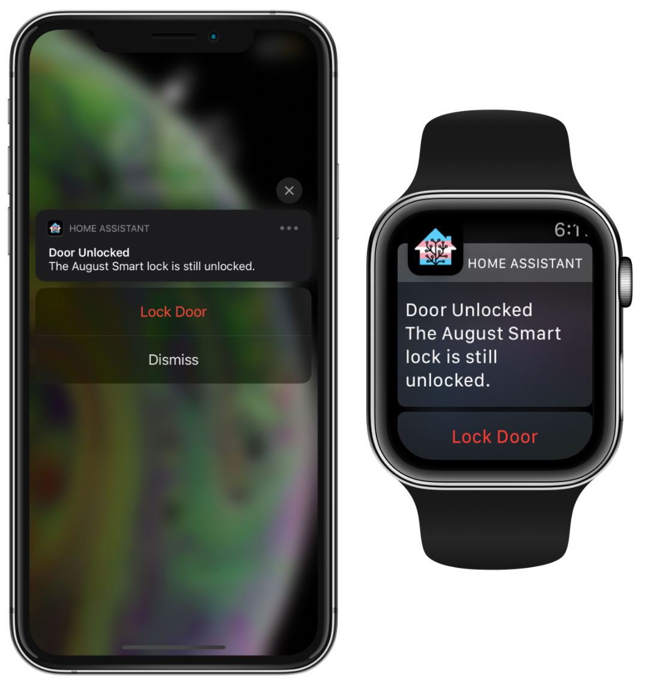
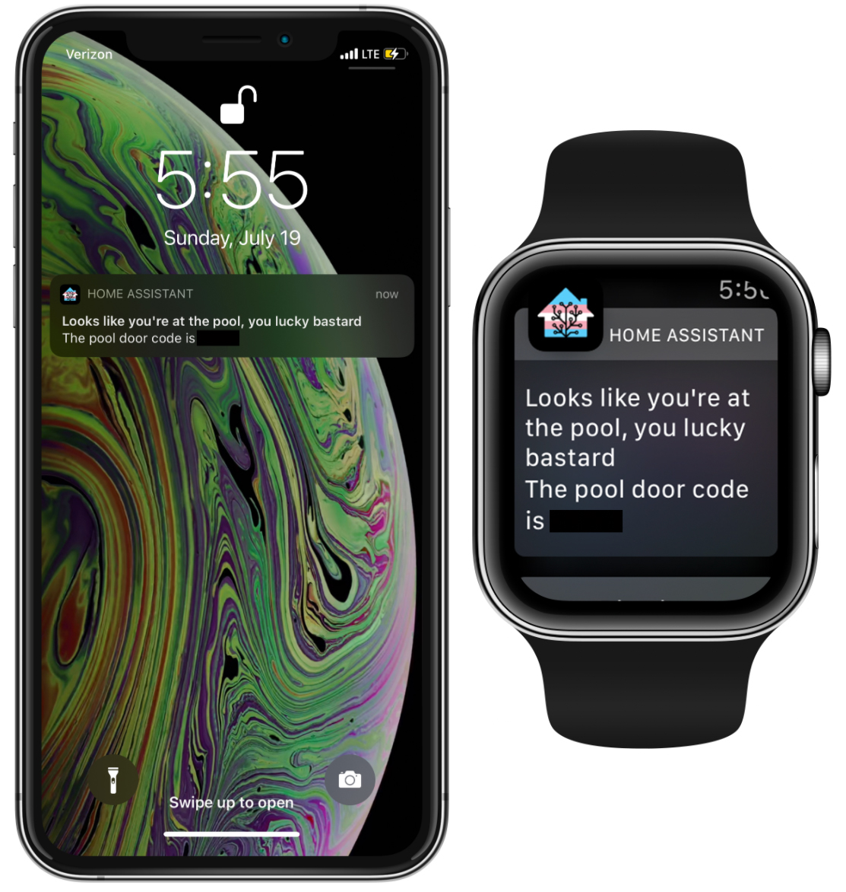

My Currrent Home Assistant Setup

<h3>Frontend</h3>

 

<h3>Ambilight Demo - Hyperion.ng & WLED</h3>
<a href="https://www.youtube.com/watch?v=KZLKFZN6v0U">Build Tutorial (YouTube)</a>

 

<h3>Zone-based actionable notifications</h3>

